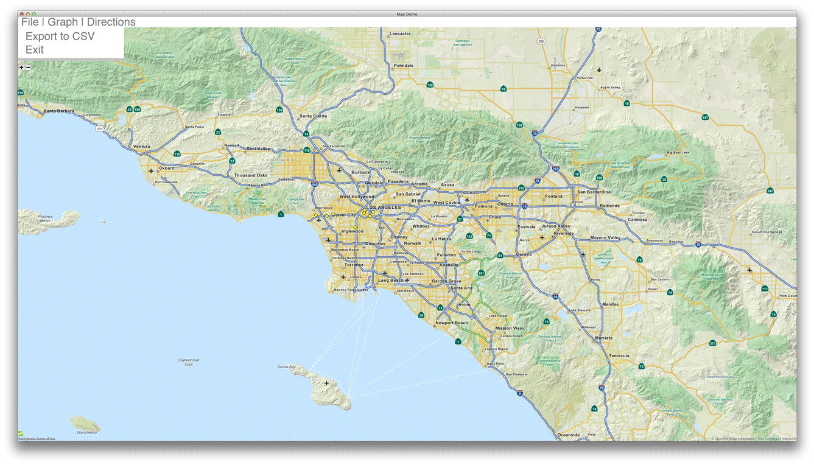
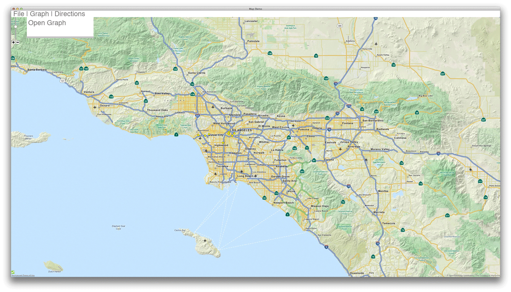
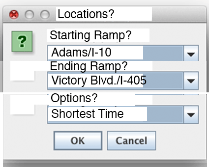
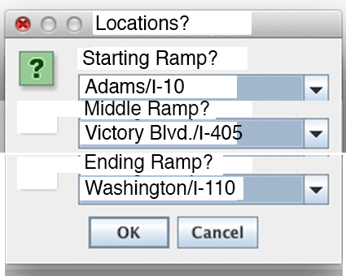
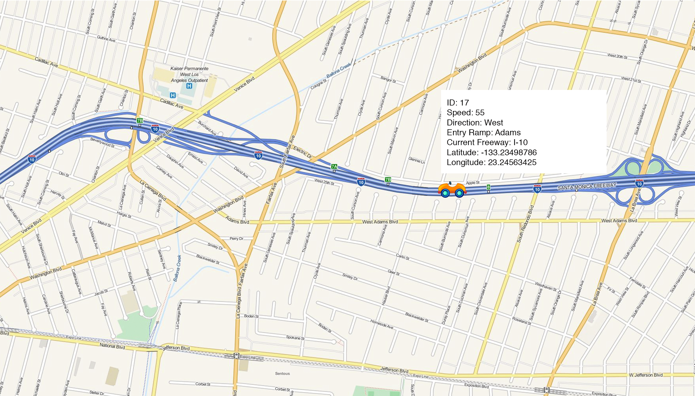

Design Document
----

Design document for out traffic simulator final project.

----
The Team:
----
+ Samir Lavingia
+ Jeffrey Kang
+ Aidan Blant
+ Ian Whelan
+ Alexei Naumann

##Premise:
----
The goal of this project is to showcase all that we have learned over the course of CSCI 201. This includes, but is not limited to: Multi-threading, Java based applications, programs using the Javax Swing library, and more.

More specifically this application will work as a traffic simulator that is constantly pulling live data from a server provided to us by Professor Miller.

##Classes:
----
+ ###Car:
	+ This class will represent the cars on the map. Each car will most likely be it's own thread.
	+ #####Parents:
		+ Runnable: Each car will be its own thread and due to Java's rules about multiple inheritence we must implement this, not inherit it.
		+ JComponent: Each car will be able to draw itself on the map, so it must have the paintComponent method overwritten. To let cars draw themselves we need to inherit this class.
	+ #####Functions:
		+ paintComponent(Graphics g)
			+ Using the location and speed the cars will draw themselves on the map with the Graphics class instance that is passed in.
		+ Getters/Setters for the data
		+ UpdateLocation:
			+ Using the location, direction, and speed of the car, this method will be called to update the location of the car on the map.
		+ Constructor:
			+ Given JSON data, a new car will be created.
	+ #####Data:
		+ int ID: This is the identification number of the car.
		+ double Speed: This is the speed at which the car is currently traveling.
		+ int startedTime: This is the time at which the car was created on the road from the JSON file input.
		+ String Direction: This will be the direction in which the car is traveling:
			+ Acceptable Strings:
				+ West
				+ North
				+ South
				+ East
			+ If the String given will not work for the highway (trying to go west on a north-south freeway) it will be remapped as given here:
				+ North -> West
				+ West -> North
				+ South -> East
				+ East -> South
		+ String Ramp: This is the name of the ramp that the car got on.
		+ String Freeway: This is the name of the freeway the car is on.
		+ double xLocation: This is the current x location of the car.
			+ I believe that we will make this work easiest for the map. This would mean latitude in degrees in this case 
		+ double yLocation: This is the current y location of the car.
			+ I believe that we will make this work easiest for the map. This would mean longitude in degrees in this case 
+ ###Database:
	+ This class will be an abstraction layer between all of the classes and the MySQL database.
	+ #####Functions:
		+ void addCar(Car car, int time): This function will add a car at the time it is on the road.
		+ ArrayList\<String> getHistory(int start, int end): This function will return the history from a start date/time to an end date/time.
		+ ArrayList\<Car>getCars(int start, int end): This function will return the cars that were on the road between the times given.
		+ ArrayList\<Integer>getBestTimesToLeave(Ramp locationOne, Ramp locationTwo): This function will return the best times to leave from location A when traveling to location B.
			+ This is going to use many calls to the function right below it in order to get the shortest time between two locations. This function will then sort these times and return the best times to leave.
<<<<<<< HEAD
		+ ArrayList<String> shorestTimeToGetFromAToB(Ramp locationOne, Ramp locationTwo, int startTime, int endTime): Some function that will find the shortest amount of time to travel between two nodes.
=======
		+ ArrayList\<String>shorestTimeToGetFromAToB(Ramp locationOne, Ramp locationTwo, int startTime, int endTime): Some function that will find the shortest amount of time to travel between two nodes.
>>>>>>> 39e1ef2f75ffc6b788edf7de58cd21f29f2f2ec8
			+ To achieve this, we are going to use Dijkstra's algorithm:
				+ The nodes will be the ramps
				+ The edge weights in this case will be the times to travel between two nodes, which will be found by looking at the speeds of the cars on the roads.
					+ We will average the speeds of the cars on that section of the freeway and use the distance to get the amount of time to travel between the two locations.
		+ void makeAndDisplayGraph(ArrayList\<ArrayList\<String>> listOfShortestTimesToGetFromAtoB): This function will make and display the graph of times and the like. It will make a Graph (another class we have) and display it in a popup. The locations it chooses from depends on the nodes that will be selected.
		+ void exportToCSV(): This function will take all this data and export it to a CSV file.
	+ #####Data:
		+ The MySQL database
+ ###Graph:
	+ This class will make and display the graph. It is just going to popup all the information we need.
	+ #####Parents:
		+ None
	+ #####Functions:
		+ void showGraph():
			+ Using the data in the ArrayList, it will create the graph.
			+ This is going to be a popup with the JPanel in it.
	+ #####Data:
		+ ArrayList\<ArrayList\<String>> data: This will be a list of the shortest times to get from A to B depending on the time and the two locations chosen. The locations it chooses from depends on the nodes that will be selected.
		+ JPanel graphPanel: This is the panel that is the actual graph that is added to the popup.
+ ###Nodes:
	+ This class will be the nodes that are overlaid on the map that the user can select to gain more data. We are going to draw this directly on the maps.
	+ #####Parents:
		+ None
	+ #####Functions:
		+ Getters and setters
	+ #####Data:
		+ double xLocation: This is the x location of the node.
			+ I believe that we will make this work easiest for the map. This would mean latitude in degrees in this case.
		+ double yLocation: This is the y location of the node.
			+ I believe that we will make this work easiest for the map. This would mean longitude in degrees in this case.
	
+ ###JSONParser:
	+ This class will pull and parse the JSON. This will be done at a certain time interval (set for three minutes at this moment).
	+ #####Parents:
		+ Thread: Because this class will run itself every X time interval, it seemed the best idea to make it its own thread that will put itself to sleep and spin back up everytime it is needed (and the OS slices it in).
	+ #####Functions:
		+ void run():
			+ This method just pulls and parses the data then puts itself to sleep for a certain time interval.
		+ void pullNewData():
			+ This method will pull the new JSON file from the server and save it locally.
		+ void parseTheData():
			+ This method will use the new pulled JSON to update and add new cars. If the car is already in the system then it will just update, else it will create a new car.
	+ #####Data:
		+ ArrayList \<Car> cars: This will be the list of cars that are parsed out of the JSON.

+ ###MapGUI:
	+ This will be the main GUI of the application where everything will happen.
	+ #####Parents:
		+ extends JFrame: So that it will be a JFrame (main centre of our applications).
		+ implements JMapEventListener: So that we can use the map and have the map move/work as we want it to.
	+ #####Data:
		+ MapPanel map: This is the map that everything will be drawn on top of.
		+ JMapViewerTree treeMap: We're not really sure what this does, but we use it for the map. :)
		+ JLabel zoomValue: This shows much much we are zoomed in on the map.
		+ Vector\<Car> cars: This holds all the cars that are on the road.
		+ Vector\<Ramp> ramps: This holds all the ramps we are going to use.
	+ #####Functions:
		+ void addTheOnOffRamps(): This pulls the on/off ramps from the JSON using their names (from the cars) and then parses them.
		+ void drawTheRampOnTheMap(Double xLocation, Double yLocation): This draws a dot on the map for the ramp at xLocation,yLocation.
		+ void parseJSONUsingPulledJSON(): This looks at the pulled JSON and looks for the xLocation and yLocation from the thing and draws it on the map.
			+ If it cannot find it, it will print out a message saying so.
		+ pullJSONUsingName(): Using the name of the ramp it will pull the JSON information about it from the Google Maps API.
			+ We will then proceed to get the location from here and stuff like that.
		+ getURLOfTheRamp(String rampName): Using the name of the ramp it will construct a string with the URL corresponding to it.
		+ constructor: Sets the defaults and makes the map panel show up/aligns stuff.
+ ###Ramp:
	+ This class will represent the ramps that we use in the program.
	+ ####Parents:
		+ None
	+ ####Data:
		+ string Name: This is the string that is the name for the ramp.
		+ double xLocation: This is the xLocation of the ramp.
		+ double yLocation: This is the yLocation of the ramp.
		+ static Vector\<Ramp> ramps: This is just a vector to hold all the ramps after they are added.
	+ ####Functions:
		+ Getters and setters for the variables

#Gui Images:
----

#Class Diagram:
----
"

